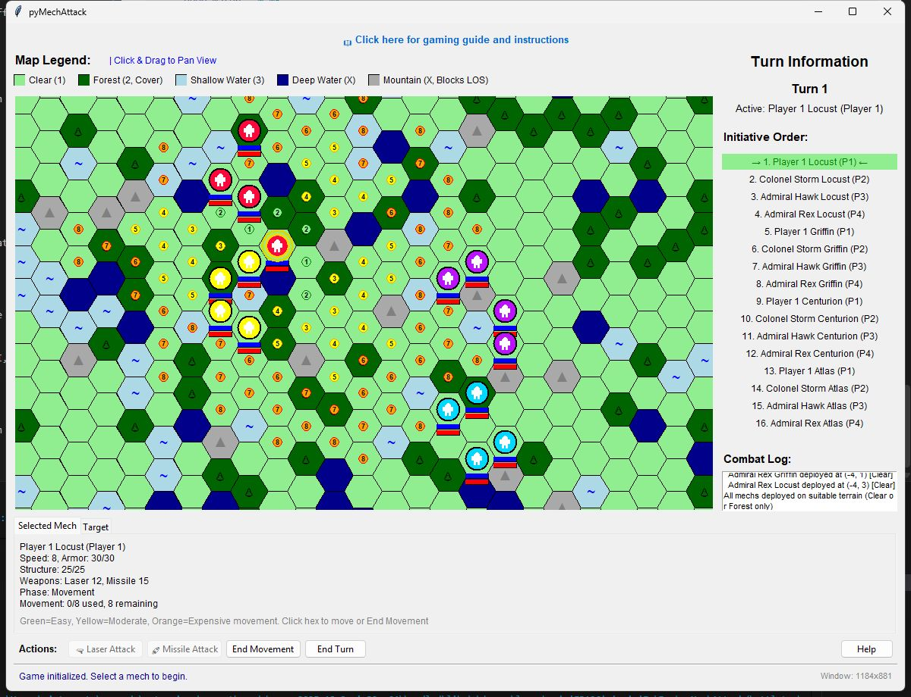

# PyMechAttack

*Because managing turn-based BattleTech combat on pen-and-paper is like playing chess while doing calculus in your head.*




## About

**The Pain:** Traditional BattleTech-style hex-based tactical combat requires tracking movement points, weapon ranges, line-of-sight calculations, initiative orders, damage tracking, and turn phases—all while managing multiple mechs across a hex grid. That's a lot of mental overhead when you just want to blow stuff up with giant robots.

**The Solution:** PyMechAttack is a streamlined, Python-powered hex-based tactical combat simulator that handles all the tedious calculations for you. It features intelligent AI opponents, smooth animations, automated turn management, and a clean Tkinter-based interface. Whether you're playing solo against AI commanders or battling friends in a hot-seat multiplayer setup, the game manages the complexity so you can focus on tactics.

**Repository:** [https://github.com/AdamMoses-GitHub/pyMechAttack](https://github.com/AdamMoses-GitHub/pyMechAttack)

## What It Does

### The Main Features
- **2-4 Player Support**: Configure 2, 3, or 4 players with mix-and-match human and AI opponents
- **Smart AI Commanders**: 16 unique AI personalities with tactical decision-making for movement and combat
- **Dynamic Hex Battlefield**: Procedurally generated terrain with forests, water, mountains affecting movement and line-of-sight
- **Turn-Based Combat**: Initiative-based activation with separate movement and attack phases
- **Visual Effects**: Smooth movement animations, laser beams, missile trails, and explosion effects
- **Flexible Positioning**: Configure starting positions (close/medium/far) to control engagement distance

### The Nerdy Stuff
- **Modular Architecture**: 15+ specialized modules for clean separation of concerns (entities, combat, AI, UI, animations)
- **A* Pathfinding**: Efficient hex-grid pathfinding with terrain cost evaluation
- **Zero External Dependencies**: Pure Python 3.10+ using only the standard library (Tkinter for GUI)
- **Canvas Object Caching**: Performance-optimized rendering with dirty-rectangle tracking
- **Line-of-Sight Algorithm**: Bresenham-style hex line drawing for accurate LOS calculations with terrain modifiers
- **Type-Safe Design**: Comprehensive type hints and custom exception hierarchy for robust error handling

## Quick Start (TL;DR)

For detailed installation and usage instructions, see [INSTALL_AND_USAGE.md](INSTALL_AND_USAGE.md).

```bash
# Clone the repository
git clone https://github.com/AdamMoses-GitHub/pyMechAttack.git
cd pyMechAttack

# Run the game (Python 3.10+ required)
python battletech_hex_game.py
```

## Tech Stack

| Component | Purpose | Why This One |
|-----------|---------|--------------|
| **Python 3.10+** | Core language | Type hints, structural pattern matching, performance |
| **Tkinter** | GUI framework | Cross-platform, bundled with Python, no external deps |
| **Standard Library** | All utilities | Zero-dependency philosophy for easy deployment |
| **Axial Coordinates** | Hex grid system | Efficient distance/pathfinding calculations vs offset coords |
| **A* Algorithm** | Pathfinding | Guaranteed optimal paths with terrain cost evaluation |
| **Canvas API** | Rendering | Direct pixel control for animations and hex drawing |

## License

This project is licensed under the MIT License - see the [LICENSE](LICENSE) file for details.

## Contributing

Pull requests are welcome! For major changes, please open an issue first to discuss what you'd like to change. This project values clean code, type safety, and modular design.

---

<sub>battletech, hex-based strategy, turn-based tactics, mech combat, python game, tkinter gui, a-star pathfinding, tactical simulator, ai opponents, procedural terrain, line of sight, initiative system, hex grid combat, robot warfare, strategy game, grid-based tactics, python gaming, desktop game, military simulation</sub>
